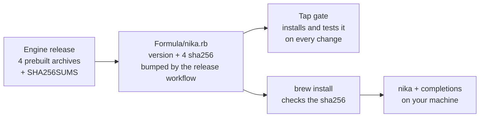

<p align="center">
  <a href="https://nika.sh">
    <picture>
      <source media="(prefers-color-scheme: dark)" srcset="https://nika.sh/brand/nika-logo-dark.svg">
      
    </picture>
  </a>
</p>

<h1 align="center">Nika for Homebrew</h1>

<p align="center">
  <strong>One command installs Nika. A minute later you have written, checked, run and verified your first AI workflow, with no account and no API key.</strong><br>
  macOS and Linux, arm64 and x64. Prebuilt, checksummed, shell completions included.
</p>

<p align="center">
  <a href="Formula/nika.rb"></a>
  <a href="https://github.com/supernovae-st/homebrew-tap/actions/workflows/test.yml"></a>
  <a href="https://github.com/supernovae-st/nika/releases/latest"></a>
  <a href="https://docs.nika.sh"></a>
  <a href="LICENSE"></a>
  <br>
  <a href="https://scorecard.dev/viewer/?uri=github.com/supernovae-st/homebrew-tap"></a>
  <a href="https://archive.softwareheritage.org/browse/origin/?origin_url=https://github.com/supernovae-st/homebrew-tap"></a>
</p>

<p align="center">
  <a href="https://github.com/supernovae-st/nika/raw/refs/heads/main/media/videos/nika-hero.mp4">
    
  </a>
</p>

<p align="center"><sub>Audit first, then run: a real run on a local model, captured from the CLI. Click the clip to watch the video.</sub></p>

## What is Nika?

Nika turns repeatable AI work into a small file you keep. Say what you
want done, like *"every Monday, pull the action items out of my meeting
notes"*, and Nika writes it as a readable `.nika` workflow. Before
anything runs, `nika check` shows what the workflow will do, which models
and tools it uses, what it is allowed to touch and what it can cost,
without calling a model. You run it when you decide, with the model you
choose, local or cloud, and every run leaves a tamper-evident record you
can verify. One Rust binary, local-first, open source (AGPL-3.0).

| 1 · Say it | 2 · Check it | 3 · Run it | 4 · Prove it |
|:---:|:---:|:---:|:---:|
| Describe the job; Nika writes a `.nika` file | `nika check` audits it before any model is called | `nika run` with the model you choose | `nika trace verify` checks the run's record |

> [!TIP]
> **This repository is Nika's Homebrew tap.** One command puts the engine's
> released binary on your Mac or Linux machine, checked against its published
> checksum, with shell completions. The engine itself is built and released
> in [supernovae-st/nika](https://github.com/supernovae-st/nika); the tap
> changes nothing in it.

## Your first minute

1. **Install Nika**, then ask it which version you got.

   ```sh
   brew install supernovae-st/tap/nika
   nika --version
   ```

2. **Write, check, run and verify a first workflow.** It runs on `mock/echo`,
   a rehearsal model built into Nika that echoes the prompt back. No account,
   no API key, and it works offline.

   ```sh
   nika compile hello hello.nika   # write hello.nika, a readable workflow file
   nika check hello.nika           # audit it before anything runs
   nika run hello.nika             # run it and record what happened
   nika trace verify               # check that the record is intact
   ```

3. **Keep going.** `nika try` lists the ready-made workflows built into Nika;
   `nika try <name>` rehearses one on the mock model without writing to your
   folder. `nika` on its own, in a project folder, opens a session: say what
   you want done, then review the `.nika` file it proposes before anything
   runs.

<!-- motion: brew install to a first verified run in one minute -->
<p align="center">
  <a href="https://github.com/supernovae-st/nika/raw/refs/heads/main/media/videos/full-loop.mp4">
    
  </a>
</p>

> [!NOTE]
> A `mock/echo` run proves that the workflow runs, not that a model answered.
> `nika check` is the static audit: it reports the plan, the model and how it
> is reached, the cost ceiling, secrets, and the permits (what the workflow
> may reach, run and read). The trace is the tamper-evident record of a run,
> kept under `.nika/traces/`. `nika compile` adds that folder to
> `.gitignore`, because a trace holds what the run read.

<details>
<summary><strong>See what each command prints</strong></summary>

Captured from the released binary on a fresh machine. Your trace file name
and chain hash will differ.

```text
$ nika compile hello hello.nika
Compile ready · source-only Check preview; Run checks its environment again.
wrote hello.nika
next · nika run hello.nika

$ nika check hello.nika
nika check · hello.nika
 ✔ PLAN     1 wave · 1 task · max parallelism 1
      wave 1 greet (infer · mock/echo)
 ✔ MODELS   1 model resolves in this binary · this machine's paths on the ACCESS line
 ✔ ACCESS   mock/echo → mock (mock · local · observed) · mock · never dials · nothing to judge
 ✔ COST     $0.0000 – $0.0000 worst-case output ceiling · prompts, exec + mcp unpriced · prices 2026-09-23
   greet  mock/echo  ≤128 tk  $0.0000
 ○ ENERGY   unpriced — no sourced Wh figure for any task model · never 0 Wh (NEP-0018)
 ✔ SECRETS  no declared secret reaches an effect · model echo untracked
 ✔ TYPES    deep references fit the shapes tasks declare · builtin output has none
 ✔ TOOLS    every named nika: tool is canonical · globs + mcp: not checked
 ✔ ARGS     every builtin invoke arg key is declared + required args present
 ✔ SCHEMA   no known-unsatisfiable form in an authored schema: · $ref opaque
 ✔ GATES    no task proven dead · status literals in vocabulary
 ✔ WRITES   no two unordered tasks write the same static path · computed paths at run · engine writes .nika/traces
 ✔ EXEC     no literal argv the exec floor refuses at run · a templated argv is the RUN's verdict
 ✔ RETRY    no `retry:` on a keyless mutating `nika:fetch` · a templated method/headers is the RUN's verdict
 ✔ ORDER    no exec: sits downstream of a net-effecting task · unauthored content never reaches a shell
 ✔ PERMITS  literal + const: args fit the boundary · computed programs, paths + symlinks are the RUN's verdict
 ✔ TRIFECTA no lethal trifecta over the declared permits: without a human gate
 ✔ JOURNEY internal · 0 sources · 0 destinations · 1 model endpoint · no secret reaches an external destination
 ✔ audited · 1 task · 1 wave · permits {} · est out ≤$0.0000 · 0 hints · risk low
 layers · valid ✔ · access ready ✔ · capacity fit ✔ · run ready ✔

$ nika run hello.nika
rehearsal: mock/echo answers by echoing the prompt — not a real answer · a real one: `--model <provider/model>` with its key, or `--access <seat>` (nika doctor lists them)
  🦋 nika · hello · 1 task
     permits ✓ declared boundary · default-deny

  ✔  greet  infer · mock/echo  0ms
  1 task · 1 wave · 0 retries · 10 tok
  ── 1/1 done · unpriced (1 call) · elapsed 0.0s ─────────────────
    wrote .nika/traces
    said "mock(echo) · Say hello in French, in one sh…"
    see it whole: nika trace outputs
    rehearsal · a mock model echoed the prompt — not a real answer
  explore: nika run hello.nika --json > run.ndjson · nika trace outputs run.ndjson
    trace: .nika/traces/2026-09-28T18-59-04Z-4cc0.ndjson · 5 events · chain b4d1867cebd541a3aa581b0ed74363408363d3353e9450b21897348f05901217

$ nika trace verify
nika trace: reading .nika/traces/2026-09-28T18-59-04Z-4cc0.ndjson (the workspace latest)
OK — 5 events · chain intact · head b4d1867cebd541a3aa581b0ed74363408363d3353e9450b21897348f05901217
  internally consistent (tamper-evident, not tamper-proof) — compare the head
  against the one the run printed to close the loop
```

`trace verify` then says whether the run was signed and replays its cost from
the record. A first run reports `UNSEALED`: intact, but not signed. Create a
run-signing key once with `nika key init`; later runs on this machine are
signed and verify as `SEALED`.

</details>

**Try a real model, still without an API key.** Install
[Ollama](https://ollama.com), then:

```sh
ollama pull qwen3.5:4b
nika try 01-hello --model ollama/qwen3.5:4b
```

Nika also works with other local engines (llama.cpp, LM Studio, vLLM) and
with API providers such as Mistral, DeepSeek, OpenAI, Anthropic and Hugging
Face, once the provider's key is in your environment. `nika catalog` lists
every provider this binary knows.

## What you can do next

<table>
  <tr>
    <td width="33%" valign="top">
      <a href="https://github.com/supernovae-st/nika/raw/refs/heads/main/media/videos/workflow-gallery.mp4"></a>
      <br><strong>Start from a ready-made workflow</strong><br>
      <code>nika try</code> lists the examples built into the binary and
      rehearses any of them on the mock model, without writing to your folder.
    </td>
    <td width="33%" valign="top">
      <a href="https://github.com/supernovae-st/nika/raw/refs/heads/main/media/videos/static-check-fix.mp4"></a>
      <br><strong>Catch mistakes before anything runs</strong><br>
      <code>nika check</code> names each problem and its fix.
      <code>nika run</code> checks again and refuses a file that fails.
    </td>
    <td width="33%" valign="top">
      <a href="https://github.com/supernovae-st/nika/raw/refs/heads/main/media/videos/editor-diagnostics.mp4"></a>
      <br><strong>See problems as you type</strong><br>
      The binary ships the language server, <code>nika lsp</code>, that the
      <a href="https://github.com/supernovae-st/nika-vscode">editor extension</a> uses.
    </td>
  </tr>
</table>

<p align="center"><sub>Each poster opens a short video captured from the real CLI.</sub></p>

A few more first commands:

| Command | What it does for you |
|---|---|
| `nika welcome` | Shows what this machine already has (editors, local models, keys) and where to start. Offline. |
| `nika doctor` | Diagnoses the machine and prints the exact fix. Changes nothing. |
| `nika wire detected --dry-run` | Previews connecting the editors and coding agents it finds to Nika's read-only MCP server. Run it without `--dry-run` to connect them. |
| `nika init` | Sets up the current repository for Nika: editor schema, `AGENTS.md`, agent files. Existing files are skipped; `.gitignore` only gains the traces line. |

## What gets installed

| One binary | Shell completions | Nothing else |
|---|---|---|
| `nika`, prebuilt for your platform and checked against the sha256 the formula pins. Nothing compiles on your machine. | Bash, zsh and fish completions, generated from `nika completions` during the install. | No background service, no post-install step, no man page, no editor or agent settings. |

When the install finishes, Homebrew shows the formula's notes: the first
commands to try, the fully local route through Ollama, how to connect your
editors and coding agents, the agent plugin kit, and `nika doctor`.

<details>
<summary><strong>Exact files and paths</strong></summary>

- **The binary** is the engine's own release archive for your platform,
  `nika-{macos|linux}-{arm64|x64}-<version>.tar.gz`, checked against the
  sha256 in the formula. There are no separate Homebrew bottles to trust: the
  formula points straight at the release.
- **The completions** are linked where each shell looks, under the Homebrew
  prefix: `etc/bash_completion.d/nika`, `share/zsh/site-functions/_nika` and
  `share/fish/vendor_completions.d/nika.fish`.
- **Your editors and agents** are left alone. Connecting them is always your
  call: `nika wire detected --dry-run` shows what it would change,
  `nika wire detected` changes it.

</details>

## Why you can trust the install



| Pinned by checksum | Real releases only | Installed for real in CI |
|---|---|---|
| Each platform's archive has its sha256 in the formula. Homebrew refuses a download that does not match. | The engine's release workflow moves the formula only for its newest public stable release, and takes each sha256 from that release's `SHA256SUMS`. Drafts and pre-releases are refused. | On every pull request and every push to `main`, the tap's gate installs the formula on macOS and runs its test block. |

<details>
<summary><strong>What the tap's gate checks</strong></summary>

[`test.yml`](.github/workflows/test.yml) runs on macOS for every pull request
and every push to `main`:

1. **No version number in this README.** The pin lives in
   [`Formula/nika.rb`](Formula/nika.rb) and nowhere else, so this page cannot
   drift from it. That is why you read "the pinned version" here, never a
   number.
2. **`brew style`** on the formula.
3. **A real install** of the formula, tapped from the checkout under test.
4. **`brew audit --except version`** on the installed formula.
5. **`brew test`**, the formula's own test block (see
   [Check, update or remove](#check-update-or-remove)).
6. **A smoke test** of the installed binary: `nika --version`, completions
   for bash, zsh and fish, `nika spec --canon` and `nika try 01-hello`.

The workflow pins every action to a commit SHA and passes no user-controlled
text to a shell. Dependabot updates those pins in one grouped pull request
each week. [`scorecard.yml`](.github/workflows/scorecard.yml) rates the
repository's supply-chain practices every week and on every push to `main`;
the OpenSSF Scorecard badge above shows the result.

</details>

<details>
<summary><strong>For maintainers: how the formula moves</strong></summary>

The formula only ever points at a real engine release tag whose archives and
checksums are published. The engine's release workflow rewrites it and pushes
the change here as a `nika <version>` commit. If that workflow cannot, the
manual fallback is `scripts/release/update-formula.sh` in the
[engine repository](https://github.com/supernovae-st/nika): it rewrites the
`version` line and the four `sha256` lines from the release's `SHA256SUMS`.
Never point the formula at a development version or at a tag that does not
exist.

</details>

## Check, update or remove

| To | Run |
|---|---|
| Check the install | `brew test supernovae-st/tap/nika` |
| Diagnose the machine | `nika doctor` |
| Update | `brew update && brew upgrade nika` |
| Remove | `brew uninstall nika && brew untap supernovae-st/tap` |

`brew test` runs the formula's test block against what you installed. It
passes only if `nika --version` reports the pinned version, a small workflow
passes `nika check`, `nika compile hello` writes a file that passes the check
too, and a one-task workflow runs to `1/1 done` on `mock/echo`. An install
that can check but not run fails. `nika doctor` covers the rest of the
machine (configuration, provider keys, local models) and prints the exact fix
without changing anything.

Not using Homebrew? The [engine README](https://github.com/supernovae-st/nika#readme)
lists the other ways to install: the install script, the npm package
`@supernovae-st/nika` ([nika-client](https://github.com/supernovae-st/nika-client))
and the release archives.

## Security

Everything this tap points at ships to every machine that runs
`brew install`, so the formula names each release archive by URL and sha256,
follows real engine release tags only, and is updated by the engine's release
workflow.

> [!IMPORTANT]
> Found a checksum mismatch, a way to hijack a download URL or an unexpected
> install step? Email **security@supernovae.studio** instead of opening a
> public issue. [SECURITY.md](SECURITY.md) describes the process and the
> response times.

<!-- city:map -->
## 🦋 The Nika family

| | Repository | What it gives you |
|---|---|---|
| 🦋 | [nika](https://github.com/supernovae-st/nika) | The engine and CLI: write, check, run and verify AI workflows |
| 📖 | [nika-docs](https://github.com/supernovae-st/nika-docs) | The documentation, live at [docs.nika.sh](https://docs.nika.sh) |
| 📜 | [nika-spec](https://github.com/supernovae-st/nika-spec) | The language specification and the suite that proves an engine follows it |
| 🧩 | [nika-vscode](https://github.com/supernovae-st/nika-vscode) | The editor extension: your workflow as a live graph, errors as you type |
| 🟦 | [nika-client](https://github.com/supernovae-st/nika-client) | Run and verify workflows from TypeScript |
| ✅ | [nika-action](https://github.com/supernovae-st/nika-action) | A GitHub Action that posts a `nika check` verdict on your pull requests |
| 🚀 | [nika-actions-starter](https://github.com/supernovae-st/nika-actions-starter) | A ready template: workflows, editor setup and CI from the first push |
| 📦 | [nika-registry](https://github.com/supernovae-st/nika-registry) | Shareable workflows, pinned and re-verified |
| 🤖 | [nika-plugins](https://github.com/supernovae-st/nika-plugins) | Teaches your coding agent (Claude Code, Codex, Cursor…) to write Nika |
| 🍺 | **[homebrew-tap](https://github.com/supernovae-st/homebrew-tap)** | **`brew install supernovae-st/tap/nika`** |
| 🐙 | [gh-nika](https://github.com/supernovae-st/gh-nika) | The Nika CLI as a GitHub CLI extension |
| 🏛️ | [nika-estate](https://github.com/supernovae-st/nika-estate) | Where each file in Nika's core repositories comes from, declared and re-checkable |
<!-- /city:map -->

## License

The formula and the other files in this repository are under the
[MIT license](LICENSE). Nika itself, the binary the formula installs, is
AGPL-3.0-or-later, as the formula declares.

<p align="center">
  <sub>Docs: <a href="https://docs.nika.sh">docs.nika.sh</a> · Security: <a href="SECURITY.md">SECURITY.md</a> · Engine: <a href="https://github.com/supernovae-st/nika">nika</a> · Issues: <a href="https://github.com/supernovae-st/nika/issues">engine tracker</a></sub>
</p>
